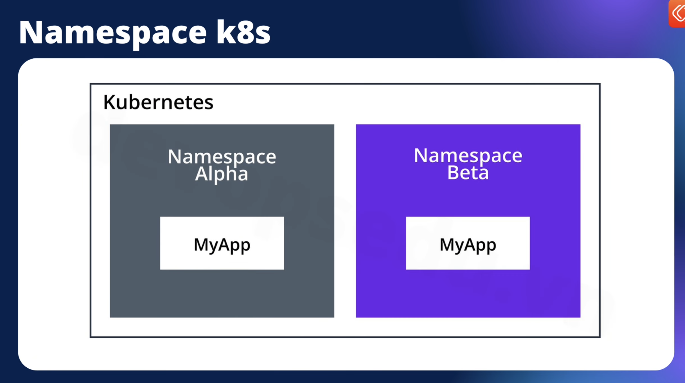
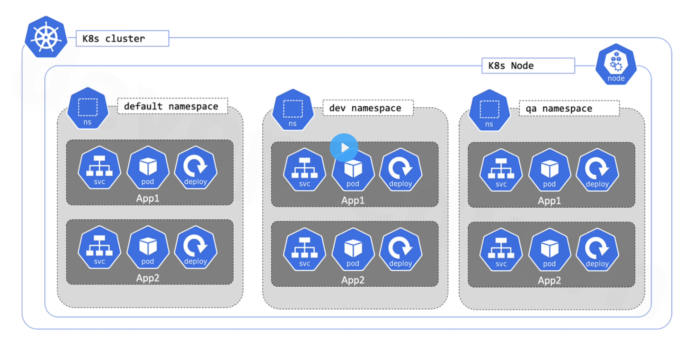

# Introduction

This repo contains my knowledge, experiences, errors while learning and implementing k8s from sketch to project

## Installation

### On-prem

There are 2 ways to install k8s on prem (manual and automatic installation)

<details>

<summary>1. Manual Installation: More time-consuming, require more debugging technical skills => More control over cluster</summary>
 
More time-consuming, require more debugging technical skills => More control over cluster

Using ```kubeadm```
This instruction will install k8s on prem with 2 concepts for different purpose, depends on project (scalability, size,..). 1 master 2 nodes or 3 master 3 nodes (master acts as workers)
***NOTE***
- The amount of VM can be changed 
- This instruction is applied for [kubeadm latest version]('https://kubernetes.io/docs/setup/production-environment/tools/kubeadm/install-kubeadm/')
- Vm examples:
| Hostname          | OS        | IP Address    | RAM (GB) | CPU (cores) |
|-------------------|-----------|---------------|----------|-------------|
| lab-k8s-master1      | Ubuntu 22.04 | 192.168.1.101 | 3        | 2           |
| lab-k8s-master2      | Ubuntu 22.04 | 192.168.1.102 | 3        | 2           |
| lab-k8s-master3      | Ubuntu 22.04 | 192.168.1.103| 3        | 2           |

- Add hosts on 3 servers
```sudo nano /etc/hosts
192.168.1.101 lab-k8s-master1
192.168.1.102 lab-k8s-master2
192.168.1.103 lab-k8s-master3
# OR
echo -e "192.168.1.101 lab-k8s-master1n192.168.1.102 lab-k8s-master2n192.168.1.103 lab-k8s-master3" | sudo tee -a /etc/hosts
```

- Update and Install new system packages
```
sudo apt update -y && sudo apt upgrade -y
```
- Create new user (It's not recommend to control k8s with user root)
```
adduser devops #(username: devops, password: devops )
su devops
cd ~
usermod -aG sudo devops #add devops user to sudoer group
```

- Disable swap
```
sudo swapoff -a
sudo sed -i '/swap.img/s/^/#/' /etc/fstab
```

- Configure Kernel Modules:
```
echo -e "overlaynbr_netfilter" | sudo tee /etc/modules-load.d/containerd.conf > /dev/null
sudo modprobe overlay
sudo modprobe br_netfilter
```

- Configure Networking
```
echo "net.bridge.bridge-nf-call-ip6tables = 1" | sudo tee -a /etc/sysctl.d/kubernetes.conf
echo "net.bridge.bridge-nf-call-iptables = 1" | sudo tee -a /etc/sysctl.d/kubernetes.conf
echo "net.ipv4.ip_forward = 1" | sudo tee -a /etc/sysctl.d/kubernetes.conf
sudo sysctl --system
```

- Install Docker, dependencies and containered
```
sudo apt install -y curl gnupg2 software-properties-common apt-transport-https ca-certificates
sudo curl -fsSL https://download.docker.com/linux/ubuntu/gpg | sudo gpg --dearmour -o /etc/apt/trusted.gpg.d/docker.gpg
sudo add-apt-repository "deb [arch=amd64] https://download.docker.com/linux/ubuntu $(lsb_release -cs) stable"

sudo apt update -y
sudo apt install -y containerd.io

# Configure containered
sudo containerd config default | sudo tee /etc/containerd/config.toml >/dev/null 2>&1
sudo sed -i 's/SystemdCgroup = false/SystemdCgroup = true/g' /etc/containerd/config.toml

# Start and enable
sudo systemctl restart containerd
sudo systemctl enable containerd

```

- Install kube package repositories
```
# If the directory `/etc/apt/keyrings` does not exist, it should be created before the curl command, read the note below.
# sudo mkdir -p -m 755 /etc/apt/keyrings
curl -fsSL https://pkgs.k8s.io/core:/stable:/v1.31/deb/Release.key | sudo gpg --dearmor -o /etc/apt/keyrings/kubernetes-apt-keyring.gpg
echo 'deb [signed-by=/etc/apt/keyrings/kubernetes-apt-keyring.gpg] https://pkgs.k8s.io/core:/stable:/v1.31/deb/ /' | sudo tee /etc/apt/sources.list.d/kubernetes.list
```

- Install k8s
```
sudo apt-get update
sudo apt-get install -y kubelet kubeadm kubectl

# Lock k8s and relates to current version => Prevent conflict => Cluster down
sudo apt-mark hold kubelet kubeadm kubectl
```


</details> 
<details> 
<summary>2. Automatic Installation: Faster, easier but less control over cluster and might not be used the latest version </summary>
- Using ```kubespray, RKE, kops```
</details> 


### Cloud
Follow this link to install k8s on [GKE](https://medium.com/finnovate-io/setting-up-a-kubernetes-cluster-in-gcp-5903c3dc46f1)


## K8s

### K8s management tools

- Commandline: K9s
- Website: Rancher, kubedashboard
- Desktop app: Lens (k8s) 

### Why K8s use yaml format? 
- Simple syntax => Easy to read/write/accessible to develop and maintain
- Support Hierarchical data => Handles nested and hierarchical structures well
- Large Support Community 

<details> 
<summary>apiVersion </summary>
- Specifies API version of K8s resource

- Why need?
    - K8s evolves overtime and resources will have multiple versions => apiVersion ensures compatibility between cluster and resource definition
    > apiVersion: v1

    > apiVersion: apps/v1
    * V1: Core group for resources: Pods, Services
    * app/v1: For Deployments, Stateful, ...

</details> 

<details> 
<summary>Kind </summary>
- Specifies type of k8s resources by being defined

- Why need?
    - Kinds tell k8s what resource you're creating or managing (Pod, Service, Deployment, Ingress,...)
    > kind: Pod

    > kind: Deployment

</details> 

</details>

<details> 
<summary>metadata </summary>
- Contains metadata information about resources such as namespace, labels, annotation,...

- Why need?
    - Helps k8s identify, sort and categorize resources
    - Key fields:
        - name: Unique name for resource within namespace
        - namespace: Logical group for resources
        - labels: key-value pairs for organizing and selecting resources
        - annotations: key-value pairs for attach additional metadata

</details> 

<details> 
<summary>spec </summary>
- Define DESIRED state or configuration of resource

- Why need?
    - Outlines how K8s should create or manage resource, 
    - Example
        ```
        spec:
            containers:
            - name: nginx-container
                image: nginx:1.21
                ports:
                - containerPort: 80
        ```
    - 

</details> 

<br>

### K8s Components

1. Namespace

- A virtual cluster within physical cluster, used to isolate and organize resources (Pods, Services, ConfigMaps,..) withing k8s cluster
- Imagine ```namespace``` is a logic grouping mechanism for management
    
    


- Use for different apps, environment (prod, staging, dev,..) => enhance security, roles, pricing, resource management
- Commands:
    - Listing namespace
        ```
        kubectl get namespace #Return all available namespace

        #OR

        kubectl get ns
        ```
    - Create new namespace
        ```
        kubectl create ns project-1
        ```
    - Delete
        ```
        kubectl delete ns project-1
        ```
    - For IAC => Create ns.yaml
        ```
        # ns.yaml
        apiVersion: v1
            kind: Namespace
            metadata:
                name: project-1

        #kubectl apply -f ns.yaml
        ```

    - Restrict resource for namespace: define resource usage for each namespace
        ```
        # esourceQouta.yaml
        apiVersion: v1
            kind: ResourceQuota
            metadata:
                name: mem-cpu-quota
                namespace: project-1
            spec:
                hard: 
                    requests.cpu: "2"
                    requests.mem: "4"
        #kubectl apply -f resourceQouta.yaml
        ```

<br>
2. Pod

- A smallest deployable unit 
- Represent a group of 1 or many containers with SHARED storage, network (IP addresses, ports) and namespace
- Pods are designed to be short-lived and disposable, if they're fail, k8s will schedule it on different node.
- Pod in a K8s cluster are used in 2 main ways:
    - Pods that run a single containers (1 container per pod): Most use case, pod will wrap around container, K8s manages pod instead of container
    - Pod that run multiple containers ( more than 1 container per pod): Pod composed multiple containers and need to share resources

- Template:
    ```
    apiVersion: v1
    kind: Pod
    metadata:
    name: my-pod
    labels:
        app: my-app
    spec:
    containers:
        - name: my-container
        image: nginx:latest
        ports:
            - containerPort: 80

    ```
- Lifecycle: Pending > Running > Scheduled > Failed > Unknown (State of pod can not be determined)
- Commands:
    * List all Pods (in current namespace)

        ```
        kubectl get pods
        ```

        ```
        kubectl get pods --all-namespace
        ```

        ```
        kubectl get pods -o wide #List pod with detailed information
        ```
    
    * Describe detailed info about 1 pod
        ```
        kubectl describe pod <name>
        ```
    * Describe logs pod
        ```
        #Describe logs of a container in a pod
        kubectl logs <pod-name>

        #Describe log of specific container in a pod
        kubectl logs <pod-name> -c <container-name>
        ```
    * Execute commands in pod
        ```
        #Open shell inside a pod
        kubectl exec -it <pod-name> -- /bin/bash

        #Run specific command in a pod
        kubectl exec <pod-name> -- <command>
        ```
    * Delete pod
        ```
        #Delete pod
        kubectl delete pod <pod-name> --namespace
        
        #Delete all pod
        kubectl delete all pod <pod-name> --namespace
        ```
 

<br>

2. Deployment
- Defines the desired state of pods and make sure the actual state matches the desired state
Example: Desired ReplicaSet has 3 pods, if 1 pod fails, it creates 1 new
- Used to create and manage ReplicaSet => ensures the availability of the specified number of idential pods
- Ideally for managing stateless applications => Focus on scaling and reliability 
- Sample:
  ```
    apiVersion: apps/v1
    kind: Deployment
    metadata:
    name: nginx-deployment
    namespace:
    labels:
        app: nginx
    spec:
    replicas: 3  # Desired number of Pod replicas
    selector:
        matchLabels:
        app: nginx  # Label selector to match Pods
    template:
        metadata:
        labels:
            app: nginx
        spec:
        containers:
        - name: nginx
            image: nginx:1.21.6  # Container image
            ports:
            - containerPort: 80  # Port exposed by the container

  ```

- Commands:

  * Create deployment:
    ```
    kubectl apply -f deployment.yaml
    ```
  * Check status deployment
    ```
    kubectl get deployments --namespace namespace
    ```
  * Check replicas set:
    ```
    kubectl get rs --namespace namespace
    ```
  * Set image (Update version):
    ```
    kubectl edit deployment/<ten-deployment> <ten-container>=<ten-image>:<tag-moi>
    ```
  * Check rollout status:
    ```
    kubectl rollout status deployment/<ten-deployment> <ten-container>=<ten-image>:<tag-moi>
    ```
  * Scale deployment:
    ```
    kubectl scale deployment --replicas=<replicas-number>

    ```
- Deployment strategy 

    * Rolling update: Gradually replace old pods with new ones while ensuring app remains stable during update
      
      * Ensures that a specified number of pods are always running, controlled by the maxUnavailable and maxSurge parameters.
      * Minimal downtime.
      * Works well for applications that can handle changes incrementally.
      * Can specify update speed by tuning parameters like maxUnavailable*

    * Recreate: Stops all existing pods before creating new ones, leading to some downtime.
      
      * Downtime occurs during the update process.
      * Simpler than Rolling Update.
      * Suitable for stateful applications or those that can't handle multiple versions running simultaneously.
    

1. 